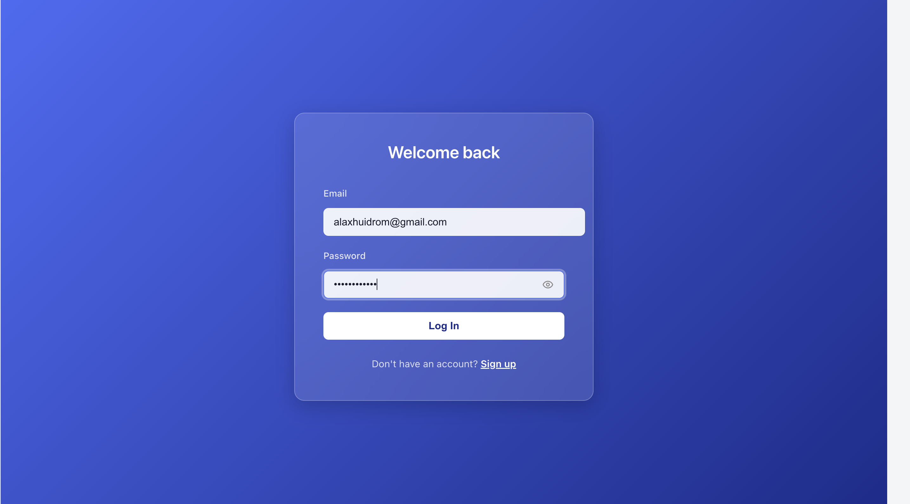
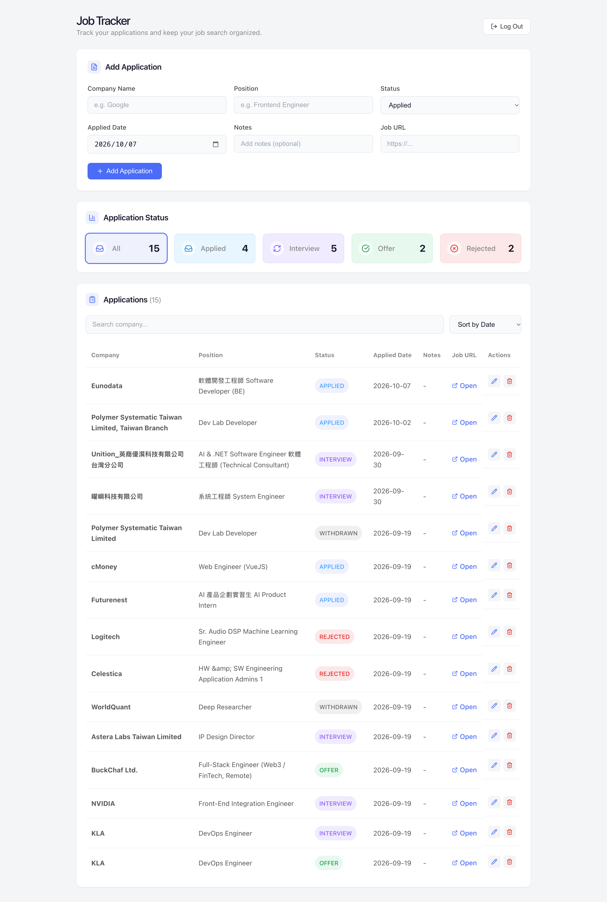
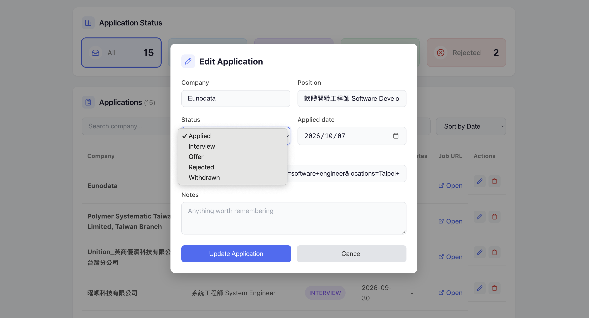
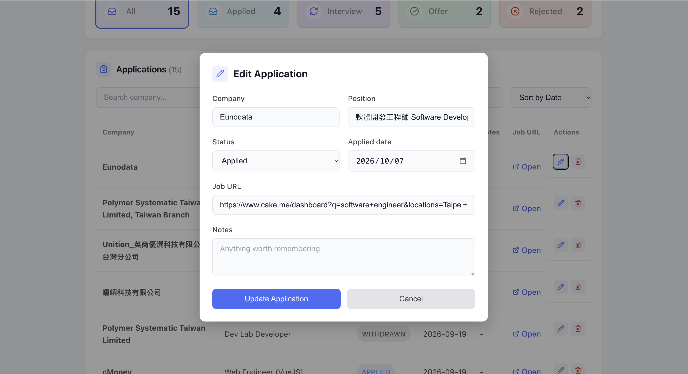

# Job Tracker

React app for tracking job applications. It talks to a Spring Boot API: [jobtracker](https://github.com/arbinita/jobtracker).

## Screenshots

**Login**



**Dashboard**



**Filtering by status**



**Edit modal**



## What it does

- Sign up and log in; pages redirect to login when there is no token, and an expired or invalid token sends you back to login
- Add, edit and delete applications (edit opens a modal, delete asks for confirmation)
- Click a status card (Applied, Interview, Offer, Rejected) to filter the table
- Search by company, sort by date or company name
- Responsive layout

## Stack

React with Vite, React Router, Axios, lucide-react for icons. Styling is plain CSS.

## Running it locally

The [backend](https://github.com/arbinita/jobtracker) needs to be running on `localhost:8080` first.

```bash
git clone https://github.com/arbinita/jobtracker-frontend.git
cd jobtracker-frontend
npm install
```

Create a `.env` file in the project root:

```
VITE_API_URL=http://localhost:8080/api/applications
```

Start it:

```bash
npm run dev
```

## Structure

```
api/          axios calls
components/   form, table, modals, status filters, login, signup
constants/    status options shared by the add form and edit modal
App.jsx       holds the state and connects the components
```

## Known limitations

- The login token is stored in localStorage
- Failed requests other than auth failures are only logged to the console, with no error message in the UI
- No tests yet
- Not deployed, it runs locally only
